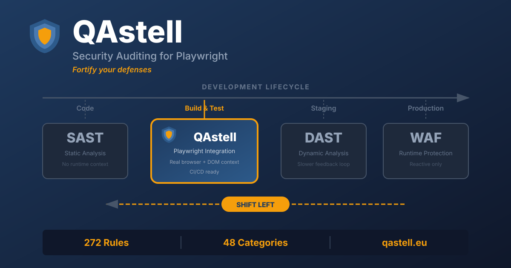

# QAstell



**Security auditing for Playwright, Puppeteer, Cypress & Selenium WebDriver - Fortify your defenses.**

## What is QAstell?

QAstell is a security audit library that integrates directly into your Playwright tests, Puppeteer scripts, Cypress tests, or Selenium WebDriver automation. It scans your web application for common security vulnerabilities and misconfigurations as part of your regular testing workflow.

With 250+ security rules across 48 categories, QAstell checks for issues like:
- Missing or misconfigured security headers (CSP, X-Frame-Options, etc.)
- Unsafe form configurations (autocomplete on passwords, missing CSRF tokens)
- Insecure external links (missing `rel="noopener"`)
- Mixed content warnings
- Inline event handlers (XSS vectors)
- Sensitive data exposure in HTML comments
- And many more...

## Why QAstell?

### Security Shift-Left

Traditional security testing happens late in the development cycle - often just before release or during dedicated security audits. By this point, vulnerabilities are expensive to fix and may delay releases.

**QAstell enables security shift-left** by integrating security checks directly into your existing tests. This means:

- **SDETs and QA engineers** can identify potential security issues during regular test runs
- **Developers** get immediate feedback when they introduce security regressions
- **Security teams** can focus on complex, application-specific vulnerabilities instead of chasing common misconfigurations

### Complementary, Not Replacement

> **Important:** QAstell is designed to **complement**, not replace, your existing security tools and practices.

QAstell does **not** replace:
- **SAST tools** (SonarQube, Checkmarx, etc.) - which analyze source code
- **DAST tools** (OWASP ZAP, Burp Suite, etc.) - which perform deep dynamic analysis
- **Penetration testing** - which requires human expertise and creativity
- **Security code reviews** - which catch logic flaws and business-specific issues

Instead, QAstell fills a gap: **continuous, automated detection of common client-side security issues during functional testing**. Think of it as an additional safety net that catches low-hanging fruit early, freeing your security specialists to focus on the harder problems.

### Who Should Use QAstell?

- **SDETs** who want to add security value to their test suites
- **QA teams** looking to catch security regressions before they reach staging
- **Development teams** practicing DevSecOps
- **Small teams** without dedicated security resources who want basic coverage
- **Anyone** who believes security is everyone's responsibility

## Try It Now - 30 Seconds

**No setup needed. Copy, paste, run.**

### Playwright (one command)

```bash
npx -y create-playwright@latest qastell-demo --quiet && cd qastell-demo && npm i qastell && echo 'import{test}from"@playwright/test";import{SecurityAuditor}from"qastell";test("security",async({page})=>{await page.goto("https://example.com");const a=new SecurityAuditor(page);const r=await a.audit();console.log("Issues:",r.summary.total,"| Critical:",r.summary.bySeverity.critical,"| High:",r.summary.bySeverity.high);});' > tests/security.spec.ts && npx playwright test security --reporter=list
```

### Puppeteer (one command)

```bash
mkdir -p qastell-demo && cd qastell-demo && npm init -y && npm i qastell puppeteer && node -e 'const p=require("puppeteer"),{SecurityAuditor}=require("qastell");(async()=>{const b=await p.launch(),pg=await b.newPage();await pg.goto("https://example.com");const a=new SecurityAuditor(pg),r=await a.audit();console.log("Issues:",r.summary.total,"| Critical:",r.summary.bySeverity.critical,"| High:",r.summary.bySeverity.high);await b.close()})();'
```

### Selenium WebDriver (one command)

```bash
mkdir -p qastell-demo && cd qastell-demo && npm init -y && npm i qastell selenium-webdriver && node -e 'const{Builder}=require("selenium-webdriver"),{SecurityAuditor}=require("qastell");(async()=>{const d=await new Builder().forBrowser("chrome").build();await d.get("https://example.com");const a=new SecurityAuditor(d),r=await a.audit();console.log("Issues:",r.summary.total,"| Critical:",r.summary.bySeverity.critical,"| High:",r.summary.bySeverity.high);await d.quit()})();'
```

### Cypress

Add to your existing Cypress project:

```bash
npm install qastell
```

Then create a test:

```typescript
// cypress/e2e/security.cy.ts
import { SecurityAuditor } from 'qastell';

it('security audit', () => {
  cy.visit('https://example.com');
  cy.window().then(async (win) => {
    const auditor = new SecurityAuditor(win);
    const r = await auditor.audit();
    cy.log(`Issues: ${r.summary.total} | Critical: ${r.summary.bySeverity.critical}`);
  });
});
```

> **Security tip:** Always review commands before running them. These one-liners install packages from npm and execute code - read them first to understand what they do.

> **Note:** First-time Playwright users may need to run `sudo npx playwright install-deps` to install system dependencies.

---

## Quick Start

**Start free - no license or registration required.**

### Playwright

```bash
npm install qastell
```

```typescript
import { test } from '@playwright/test';
import { SecurityAuditor } from 'qastell';

test('security audit', async ({ page }) => {
  await page.goto('https://example.com');

  const auditor = new SecurityAuditor(page);
  await auditor.assertNoViolations();
});
```

### Puppeteer

```bash
npm install qastell puppeteer
```

```typescript
import puppeteer from 'puppeteer';
import { SecurityAuditor } from 'qastell';

const browser = await puppeteer.launch();
const page = await browser.newPage();
await page.goto('https://example.com');

const auditor = new SecurityAuditor(page);
await auditor.assertNoViolations();

await browser.close();
```

### Selenium WebDriver

```bash
npm install qastell selenium-webdriver
```

```typescript
import { Builder } from 'selenium-webdriver';
import { SecurityAuditor } from 'qastell';

const driver = await new Builder().forBrowser('chrome').build();
await driver.get('https://example.com');

const auditor = new SecurityAuditor(driver);
await auditor.assertNoViolations();

await driver.quit();
```

### Cypress

```bash
npm install qastell cypress
```

```typescript
import { SecurityAuditor } from 'qastell';

describe('Security', () => {
  it('should pass security audit', () => {
    cy.visit('https://example.com');

    cy.window().then(async (win) => {
      const auditor = new SecurityAuditor(win);
      const results = await auditor.audit();

      cy.log(`Found ${results.summary.total} violations`);
      await auditor.assertNoViolations();
    });
  });
});
```

### Extended Examples (multi-line)

<details>
<summary><strong>Playwright - Full Example</strong></summary>

```bash
mkdir qastell-demo && cd qastell-demo
npm init -y
npm install qastell @playwright/test
npx playwright install chromium
cat > quickstart.spec.ts << 'EOF'
import { test } from '@playwright/test';
import { SecurityAuditor } from 'qastell';
test('security audit', async ({ page }) => {
  await page.goto('https://qastell.eu');
  const auditor = new SecurityAuditor(page);
  const results = await auditor.audit();
  console.log(`Found ${results.summary.total} issues`);
});
EOF
npx playwright test quickstart.spec.ts --reporter=list
```

</details>

<details>
<summary><strong>Puppeteer - Full Example</strong></summary>

```bash
mkdir qastell-demo && cd qastell-demo
npm init -y
npm install qastell puppeteer typescript ts-node @types/node
cat > quickstart.ts << 'EOF'
import puppeteer from 'puppeteer';
import { SecurityAuditor } from 'qastell';
(async () => {
  const browser = await puppeteer.launch();
  const page = await browser.newPage();
  await page.goto('https://qastell.eu');
  const auditor = new SecurityAuditor(page);
  const results = await auditor.audit();
  console.log(`Found ${results.summary.total} issues`);
  await browser.close();
})();
EOF
npx ts-node quickstart.ts
```

</details>

<details>
<summary><strong>Selenium WebDriver - Full Example</strong></summary>

```bash
mkdir qastell-demo && cd qastell-demo
npm init -y
npm install qastell selenium-webdriver typescript ts-node @types/node
cat > quickstart.ts << 'EOF'
import { Builder } from 'selenium-webdriver';
import { SecurityAuditor } from 'qastell';
(async () => {
  const driver = await new Builder().forBrowser('chrome').build();
  await driver.get('https://qastell.eu');
  const auditor = new SecurityAuditor(driver);
  const results = await auditor.audit();
  console.log(`Found ${results.summary.total} issues`);
  await driver.quit();
})();
EOF
npx ts-node quickstart.ts
```

</details>

<details>
<summary><strong>Cypress - Full Example</strong></summary>

```bash
mkdir qastell-demo && cd qastell-demo
npm init -y
npm install qastell cypress typescript
cat > cypress/e2e/security.cy.ts << 'EOF'
import { SecurityAuditor } from 'qastell';

it('security audit', () => {
  cy.visit('https://qastell.eu');

  cy.window().then(async (win) => {
    const auditor = new SecurityAuditor(win);
    const results = await auditor.audit();
    cy.log(`Found ${results.summary.total} issues`);
  });
});
EOF
npx cypress run --spec "cypress/e2e/security.cy.ts"
```

</details>

## Examples

See the [examples](./EXAMPLES.md) for detailed usage patterns including:
- Basic audits
- Custom severity thresholds
- Category filtering
- HTML report generation
- CI/CD integration
- Jest integration (Puppeteer)

## Learn More

- [Website](https://qastell.eu)
- [Documentation](https://qastell.eu/docs.html)
- [Playwright Guide](https://qastell.eu/docs-playwright.html)
- [Puppeteer Guide](https://qastell.eu/docs-puppeteer.html)
- [Cypress Guide](https://qastell.eu/docs-cypress.html)
- [WebDriver Guide](https://qastell.eu/docs-webdriver.html)
- [Pricing](https://qastell.eu/index.html#pricing)
- [Report Issues](https://github.com/robintel/qastell-community/issues)

## License

QAstell is available under a tiered licensing model:
- **Free (Non-Commercial)**: 10 scans/day, HTML reports
- **Enterprise**: 100 scans/day, HTML + JSON reports
- **Corporate**: Unlimited scans, all report formats including SARIF

See [pricing](https://qastell.eu/index.html#pricing) for details.

---

Made in the 🇪🇺 with ❤️ for people, environment, and [diversity](https://x.com/eeldenden/status/1950639923632971784).
